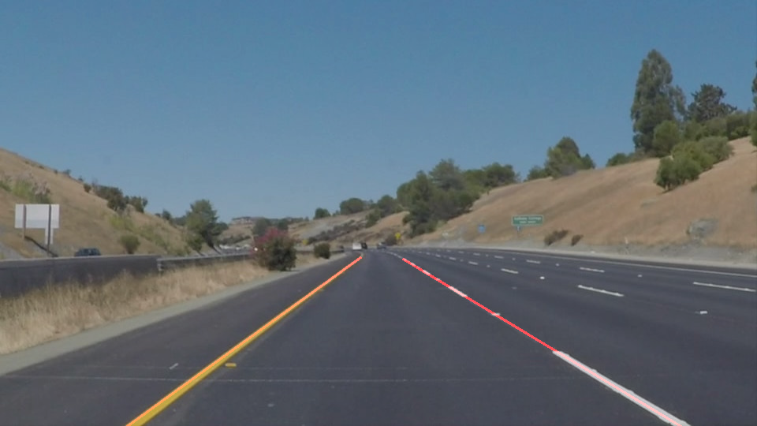

# Self-Driving Car Engineer Nanodegree Program
# *CarND-Finding-Lane-Lines*

## Overview

The task of this project was to detect lane lines in images or movies and to mark them. Python and OpenCV were used to analyze and to prepare the images.

Results:
* Marked lane lines in white  [YouTube video] (https://www.youtube.com/watch?v=iiU0K6SGehY)

